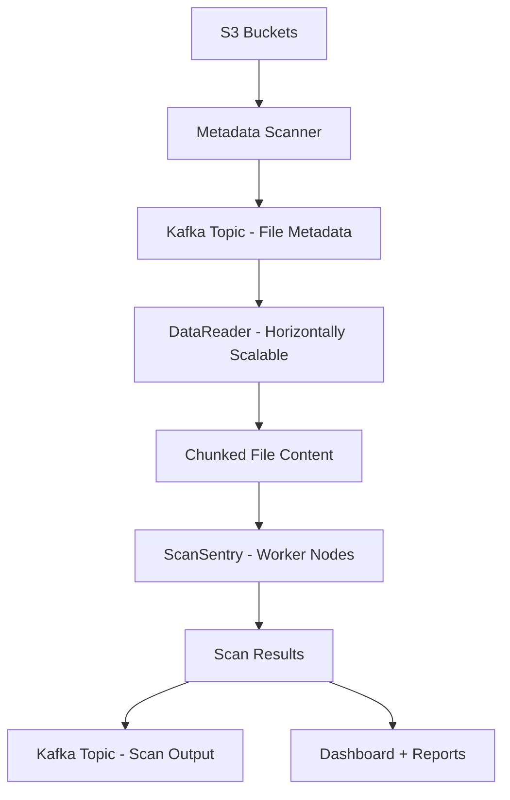

# S3 Sensitive Data Scanner

An open-source project to scan an organization's entire Amazon S3 storage (\~100PB) for sensitive data types like PII, secrets, and credentials—efficiently and cost-effectively within 1 year.

---

## 🚀 Key Features

* Scan 100PB+ S3 data using scalable and modular architecture
* Push metadata to Kafka for distributed processing
* Horizontal scaling with reactive Spring-based services
* Detection using regex, ML/NLP, or LLM-based plugins
* Visual dashboards for insights and trends
* Cost optimization strategies (spot instances, Range GETs, Bloom filters)

---

## 📐 Architecture Diagram



---

## 🧱 System Components

### Metadata Scanner

* Periodically scans S3 Inventory or ListObjectsV2
* Extracts object metadata
* Publishes to Kafka

### DataReader

* Horizontally scalable consumers
* Reads file chunks using S3 Range GETs
* Parses common file formats

### ScanSentry

* Regex and ML-based data detectors
* LLM plugin support (optional)
* Outputs scan results to Kafka

### Dashboard

* Powered by Kibana or Grafana
* Real-time trends and coverage stats

---

## 📦 Tech Stack

* Java + Spring WebFlux (Reactive)
* Apache Kafka
* AWS SDK v2
* Elasticsearch / Clickhouse
* Kibana / Grafana
* Optional Python plugins for ML/LLM

---

## 💰 Cost Optimizations

* Spot instances
* Avoid full downloads (Range GET)
* Sampling and risk prioritization
* Bloom filters to skip known-safe files

---

## 📈 Output Format

```json
{
  "bucket": "prod-data-archive",
  "objectKey": "2021/user_data.csv",
  "offsetRange": "10456-10575",
  "sensitiveType": "SSN",
  "sample": "***-**-1234"
}
```

---

## 🛠️ Getting Started (Planned)

> 🚧 This section will be populated as components are implemented.

* [ ] Setup Kafka + Topics
* [ ] Implement Metadata Scanner
* [ ] Build DataReader
* [ ] Develop ScanSentry engine
* [ ] Integrate dashboards

---

## 📅 Development Timeline

| Week | Milestone                       |
| ---- | ------------------------------- |
| 1    | Metadata Scanner + Kafka topics |
| 2    | DataReader with chunking        |
| 3    | ScanSentry detection logic      |
| 4    | Dashboards + GitHub polish      |

---

## 🙌 Contributing

This project is designed to showcase scalable architecture and system design. Contributions welcome via pull requests, issue reports, or plugin ideas.

---

## 🧠 Author

ravikalla – [GitHub](http://github.com/ravikalla) | [LinkedIn](https://www.linkedin.com/in/ravikalla/)

---

## 📄 License

MIT License
